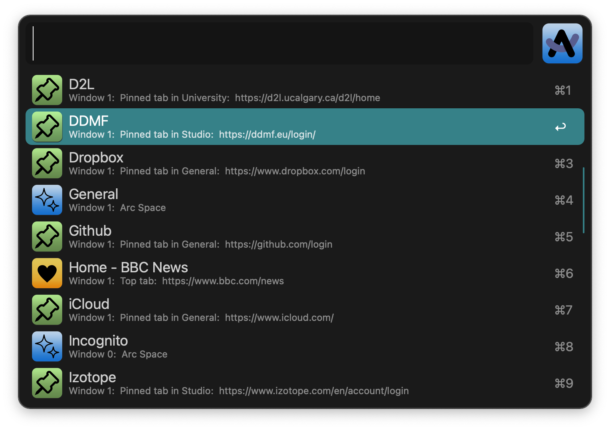

# Alfred Workflow: Open Arc Tab

## Description

This workflow searches the Arc application for pinned, unpinned, and top
tabs, as well as named spaces, enabling the user to select a particular
tab or space to open. The user can configure the workflow to separately
include or exclude pinned, unpinned, and top tabs, as well as spaces.
The user can also specify if the search results are presented in sorted
alphabetic order or in "natural order", where the tabs and spaces are
listed as they appear in the Arc browser's sidebar. The workflow can
also handle the situation where there are multiple Arc windows open,
each with multiple spaces and tabs.

For tabs, the search results will show the tab name as the main title,
and the window number (if there are multiple windows open), the kind of
tab, the space name, and the corresponding URL as the subtitle. For
spaces, the search results will show the space name as the main title,
and "Arc Space" as the subtitle.

This workflow can be triggered by typing the "[" character after
invoking Alfred, or with the option-commmand-[ hotkey. No space is
needed after the "[" character, which makes starting the search process
very efficient.

Although the workflow depends on the Arc application being installed, it
will gracefully handle the situation where it is not installed, and will
display an error message.

Note that there may be no search results to display if the user has
configured the workflow to exclude all tabs and spaces, or if the Arc
browser does not have any windows currently open. The workflow will
handle this situation gracefully, and will display an error message.

## Installation

Download the "Open Arc Tab.alfredworkflow" file onto your computer, and
then double click on the file to add it to the Alfred application. The
user will be given the option to customize the hot key and keyword used
to trigger the workflow.

## Screenshots

### Main Search Window

### Error Message Displays

### Workflow Configuration Panel

